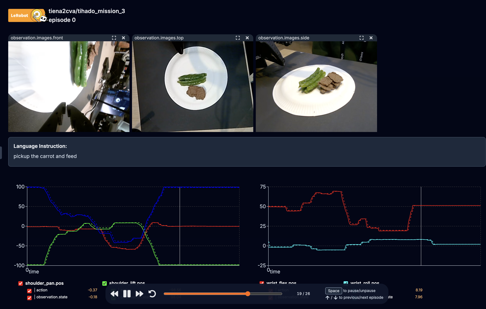
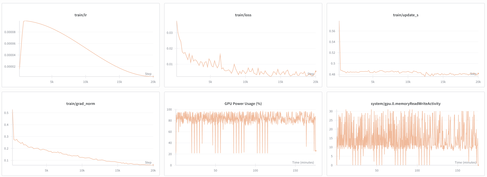

# AMD_Robotics_Hackathon_2025_Tihado

## Team Information

**Team:** 13 - Tihado Team

**Members:**

- 🐍 Hồng Hạnh - [@honghanhh](https://github.com/honghanhh)
- 🐍 Việt Tiến - [@nvti](https://github.com/nvti)
- 🐍 Nhật Linh - [@Nlag](https://github.com/NLag)
- 🐍 Phương Nhi - [@pnhneeechuu](https://github.com/pnhneeechuu)

**Summary:**  
**EatAble** is a voice-controlled robotic assistant designed to empower people with **upper limb disabilities** to eat independently — restoring **dignity**, **freedom**, and **equality** through accessible AI and robotics.

At its core, EatAble allows a person to simply **say what they want to eat**, and the robot will find that item on the table and **gently feed them**.

For example:

> “I want to eat beef.”  
> ✅ Robot detects beef  
> ✅ Picks it up using robotic arm  
> ✅ Brings it to the user’s mouth

This project started with feeding, but the long-term vision is broader: **Creating a world where disability does not limit autonomy.**

[🎥 Watch the demo video](#)

---

## 1. Mission Description

### 🌍 Real-world application

Millions of people live with physical disabilities that make daily tasks — even eating — a challenge. For many, this means:

- Relying on others for basic needs
- Losing a sense of independence
- Feeling isolated in everyday life

**EatAble** is designed to help **restore independence and dignity** using affordable, real-time technology that can work at home, in hospitals, or in care centers.

> “We don’t just build robots.  
> We build freedom — one meal at a time.”

#### Use Cases:

- 👩‍🦽 Supporting people with upper limb disabilities
- 🧓 Assisting elderly individuals who struggle with mobility
- 🏥 Deploying in hospitals, rehabilitation centers, and care homes
- 🏠 Enabling independent living at home with affordable robotics

> **“From a meal... to a life of independence.”**  
> Because eating isn't just survival — it's about dignity.

---

## 2. Creativity

### 💡 What makes EatAble different?

EatAble combines cutting-edge AI with human-centered design to create an assistive robot that understands natural communication and adapts to real-world scenarios.

#### 🗣️ Conversational Intelligence Beyond Commands

EatAble uses **large language models (LLM)** for natural language understanding, eliminating the need for users to memorize commands. Users speak naturally — "I'm hungry", "I want to eat beef" — and the system interprets intent with a friendly, conversational personality.

#### 👁️ Multi-Perspective Vision: Seeing Like a Human

A **tri-camera system** (top, side, front) provides multi-view perception that mimics human visual understanding, enabling accurate 3D localization, spatial relationship understanding, and robust performance across different table setups and lighting conditions.

#### 🧠 Unified Vision-Language-Action Intelligence

EatAble uses **SmolVLA (Small Vision-Language-Action)**, an end-to-end policy model that unifies perception, planning, and control. The model simultaneously processes visual observations and language instructions, generating contextual actions rather than following pre-programmed sequences. This allows adaptation to new scenarios without reprogramming.

#### ❤️ Accessibility-First Philosophy

Designed with **accessibility and affordability** as core principles: uses standard hardware, optimized for real-time inference on consumer GPUs (AMD Instinct™ MI300X), minimal setup requirements, and dignity-preserving design that respects user autonomy.

#### 🔄 End-to-End Learning from Demonstration

EatAble learns from **teleoperated demonstrations**, capturing natural human movements and strategies. This approach scales to new tasks, adapts to user preferences, and reduces development time compared to traditional programming.

---

## 3. Technical implementations

### Teleoperation / Dataset capture



We created 2 datasets for training the policy model:

- **[Dataset 1](https://huggingface.co/datasets/tiena2cva/tihado_mission_3)**:

  - This dataset is used to train the policy model for the task of picking up the carrot and feeding it to the user.
  - Contains 50 episodes

- **[Dataset 2](https://huggingface.co/datasets/tiena2cva/tihado_mission_2)**:
  - This dataset is used to train the policy model for the task of picking up the meat and feeding it to the user.
  - Contains 30 episodes

We use **3 cameras** positioned at different angles to provide comprehensive visual coverage of the robot's workspace:


For more details, please refer to the [dataset capture README](./mission/data/README.md).

### Training

**Approach:** The project utilizes the pre-trained `lerobot/smolvla_base` model, which was trained on teleoperated demonstrations. The SmolVLA model combines vision-language understanding with robotic control, enabling it to follow natural language instructions for manipulation tasks.

All training was done on an AMD Instinct™ MI300X GPU on AMD Developer Cloud.



We trained the model for **40,000** steps with a batch size of 64. The total training time was approximately **8 hours**.

**Model:** SmolVLA (Small Vision-Language-Action) Policy

- **Base Model:** `lerobot/smolvla_base` (pre-trained)
- **Framework:** LeRobot Hugging Face
- **Training Infrastructure:** AMD Instinct™ MI300X GPU support via AMD Developer Cloud

The SmolVLA model was pre-trained on teleoperated demonstrations, learning to map visual observations and language instructions to robotic actions. The model architecture combines:

- Vision encoder for processing multi-view camera inputs
- Language encoder for understanding task instructions
- Action decoder for generating robot control commands

The trainning command:

```bash
lerobot-train \
  --dataset.repo_id="tiena2cva/tihado_mission_2" \
  --batch_size=64 \
  --steps=20000 \
  --output_dir="outputs/train/pick_everything" \
  --job_name=pick_meat_and_carrot \
  --policy.path="tiena2cva/tihado_model_3" \
  --policy.repo_id="tiena2cva/tihado_model_3.1" \
  --policy.device=cuda \
  --policy.push_to_hub=true \
  --wandb.enable=true \
  --rename_map='{"observation.images.top":"observation.images.camera1", "observation.images.side":"observation.images.camera2", "observation.images.front":"observation.images.camera3"}'
```

Some our training experiments: [Training Experiments](./mission/training/README.md)

### Inference

**Inference Pipeline:**

0. **Prerequisites:**

   - Connect to the robot
   - Load the model (`SmolVLAPolicy.from_pretrained("tiena2cva/tihado_model_3.1")`) and push it to AMD GPU

1. **Voice Input:** User speaks natural language command (e.g., "I want to eat carrots")
2. **Speech Recognition:** Google Speech Recognition API converts audio to text
3. **Intent Understanding:** OpenAI GPT-4o-mini with structured output parsing determines action intent
4. **Task Execution:** Robot receives task instruction ("feed") and:

   - Captures multi-view observations from cameras
   - Builds inference frame with task context
   - Preprocesses observations for model input
   - SmolVLA model selects action based on visual observations and task
   - Postprocesses and sends action to robot
   - Monitors action magnitude for task completion
   - Continues until task complete or timeout (45 seconds)
   - We created a `custom action threshold detection` to detect when the task is complete.

Details of inference code: [robot.py](./mission/code/robot.py)

**Hardware Configuration:**

- **Device:** CUDA-enabled GPU
- **Robot Port:** `/dev/ttyACM1`
- **Robot ID:** `tihado_follower`
- **Max Task Duration:** 45 seconds per task

---

## 4. Ease of use

**How generalizable is your implementation across tasks or environments?**

- **Task Generalization:** The SmolVLA model can be extended to various manipulation tasks beyond feeding (e.g., object manipulation, assistance tasks) by providing different task instructions
- **Environment Adaptation:** Multi-view camera system provides robust perception across different table setups and lighting conditions
- **Language Flexibility:** Natural language interface allows users to express requests in various ways, with LLM handling intent understanding
- **Hardware Portability:** Implementation uses standard LeRobot framework, making it adaptable to different robot platforms that support the framework

**Flexibility and adaptability of the solution:**

- **Modular Architecture:** Separated voice assistant, robot control, and model inference components allow for easy modification and extension
- **Dummy Mode:** Supports testing without physical robot hardware
- **Configurable Parameters:** Camera indices, robot ports, and model parameters can be adjusted for different setups
- **Action Threshold Detection:** Automatic task completion detection prevents unnecessary robot movements

**Types of commands or interfaces needed to control the robot:**

- **Primary Interface:** Natural language voice commands

  - **Speech Recognition:** Google Speech Recognition API converts spoken audio to text
  - **Intent Understanding:** OpenAI GPT-4o-mini with structured output parsing interprets user intent and extracts actionable commands
  - **Natural Language Flexibility:** Users can express requests in various ways without memorizing specific commands
    - Feeding requests: "I want to eat carrots", "feed me", "I'm hungry", "can you feed me?", "I want to eat beef", "I feel like eating vegetables"
    - General conversation: Questions about menu, casual chat, inquiries about capabilities
    - Exit requests: "exit", "quit", "goodbye", "bye", "see you", "I'm done", "I'm full", "that's enough"

- **Action Types:**

  - **"feed" action:** Triggers the robot to pick up food and feed the user
    - Automatically triggered when user expresses hunger, requests food, or asks to be fed
    - Executes in parallel with voice response for seamless interaction
  - **"bye" action:** Gracefully terminates the system when user indicates they're finished
  - **"none" action:** Handles general conversation without triggering robot movement

- **Voice Assistant Features:**

  - **Conversational AI:** Friendly, witty, and humorous personality for natural interaction
  - **Automatic Action Triggering:** LLM determines appropriate action based on conversation context
  - **Multilingual Support:** ElevenLabs multilingual voice model enables voice output in multiple languages
  - **Context-Aware Responses:** Understands user's condition (limited mobility) and provides supportive, appropriate responses

- **Programmatic Interface:**

  - **Robot Class API:** Direct Python interface for programmatic control
    - `Robot.run(task)` method accepts task types (e.g., "feed")
    - Supports dummy mode for testing without physical hardware
    - Configurable parameters: camera indices, robot ports, model paths, action thresholds
  - **Command-Line Scripts:** Alternative interface using bash scripts for task execution
    - Can be invoked via subprocess for integration with other systems

- **Hardware Interface:**
  - **Robot Connection:** Serial communication via `/dev/ttyACM1` (configurable)
  - **Camera Input:** Multi-view camera system (3 cameras) for visual perception
  - **Action Output:** Real-time control commands sent to robotic arm for manipulation

---

## 5. Additional Links

<!-- - **Demo Video:** [Link to video of your robot performing the task](#) -->

- **Dataset:**
  - [Dataset 1](https://huggingface.co/datasets/tiena2cva/tihado_mission_3): This dataset is used to train the policy model for the task of picking up the carrot and feeding it to the user.
  - [Dataset 2](https://huggingface.co/datasets/tiena2cva/tihado_mission_2): This dataset is used to train the policy model for the task of picking up the meat and feeding it to the user.
- **Model:** [Model](https://huggingface.co/tiena2cva/tihado_model_3.1): Final model after training on both datasets.
- **Utility Scripts:**
  - [Inference Async](./mission/code/scripts/inference-async.sh): Code for the inference asynchronous.
  - [Inference RTC](./mission/code/scripts/inference-rtc.sh): Code for the inference real-time communication.
  - [Inference Record](./mission/code/scripts/inference-record.sh): Code for the inference using `lerobot-record`.
  - [Operate Camera](./mission/code/scripts/operate_camera.sh): Helper script to operate the follower arm.
  - [Record](./mission/code/scripts/record.sh): Code for the recording dataset.
  - [Split Dataset](./mission/code/scripts/split_dataset.sh): Code for the splitting dataset into train, test and val.
