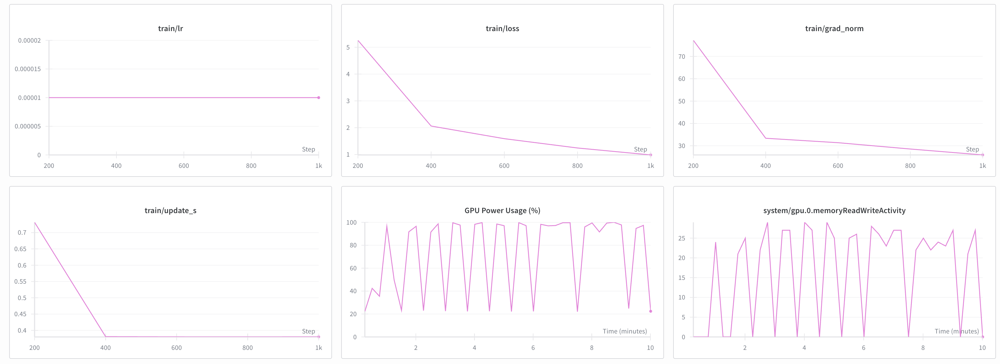

# Training Experiments

After capturing the dataset, we started training the policy model. This document describes our training experiments and the approaches we tried.

## Training ACT Policy from Scratch

We began by training the ACT Policy from scratch. However, after 10,000 steps of training, the performance was not satisfactory: the loss remained high and the robot arm could not successfully complete the task.

Possible reasons for the poor performance include insufficient dataset size or the need for more training steps. However, we had limited time to continue this approach.

## Training SmolVLA Policy from Scratch

We then tried training the SmolVLA Policy from scratch. Unfortunately, the results were similar to the ACT Policy training—the model did not achieve satisfactory performance.

## Training SmolVLA Policy from Pre-trained Model

We then tried training the SmolVLA Policy using a pre-trained model (`lerobot/smolvla_base`) as the starting point. This approach proved successful.

### Initial Training

- **Steps:** 20,000
- **Batch size:** 64
- **Training time:** ~4 hours
- **Result:** The robot arm can now successfully perform the task!

### Extended Training

We continued training the model for an additional 20,000 steps using an extended dataset. The results remained good, confirming the model's stability and performance.

**Total training:** 40,000 steps over ~8 hours

## Key Findings

1. **Pre-trained models are essential:** Training from scratch did not yield satisfactory results within our time constraints, while fine-tuning a pre-trained model (`lerobot/smolvla_base`) was successful.

2. **Dataset size matters:** The combination of multiple datasets (80 total episodes) provided sufficient diversity for effective training.

3. **Training stability:** The model maintained good performance even after extended training, indicating stable convergence.

## Future Work

If we had more time, we could explore:

- Creating a more complex dataset with different object positions and orientations
- Training on more complex tasks with different objects and scenarios
- Implementing face and mouth tracking for more precise feeding
- Experimenting with different hyperparameters and training strategies
- Evaluating performance on a wider variety of food items and table configurations
- Online learning approach to continuously improve the model
